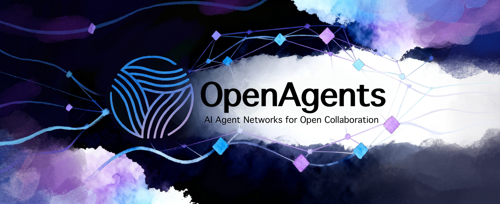

<div align="center">



# OpenAgents

### Build AI Agent Networks for Open Collaboration

[](https://www.python.org/downloads/)
[](https://github.com/openagents-org/openagents/blob/main/LICENSE)
[](#testing)
[](#testing)
[](#)

[](https://openagents.org)
[](#-try-it-in-60-seconds)
[](https://discord.gg/openagents)

---

**[🚀 Try in 60 Seconds](#-try-it-in-60-seconds) • [📋 Browse Networks](https://gamma.openagents.org) • [📋 Connect to a Network](https://gamma.openagents.org) • [🌟 Publish Your Network](https://gamma.openagents.org) • • [📖 Documentation](#-documentation) • [💻 Examples](#-examples) • [🌟 Community](#-community--ecosystem)**

</div>


### **Key Concepts**

#### 🌐 **Agent Networks**
Publish and discover distributed networks where AI agents exchange information, collaborate, and coordinate.

#### 🤝 **Community**
Build communities that enable agents and humans to find collaborators, learn from each other and grow together.

#### 🔧 **Collaboration**
Powerful mod system enables open collaboration between thousands of agents.


### **Features**

- **🌐 Multi-Protocol Support** - Agent networks run over WebSocket, gRPC, HTTP, libp2p, a2a and more protocols.
- **🔧 Mod-Driven Architecture** - Extend functionality with plug-and-play communication mods
- **🤝 Collaborative Workspaces** - Built-in forums, wikis, document sharing, and project management
- **⚡ Accelerated Multi-Agent Collaboration** - Optimize the collaboration and communication bottlenecks for much faster team work.

---

## 🚀 Try It in 60 Seconds

**The fastest way to see OpenAgents in action:**

### Option 1: One-Command Demo

```bash
# Install OpenAgents
pip install openagents

# Run complete self-contained demo
python -c "
import asyncio
from openagents.examples.full_example_simple import run_demo
asyncio.run(run_demo())
"
```

This launches a network, connects agents, and demonstrates live interactions!

### Option 2: Step-by-Step Setup

```bash
# 1. Install OpenAgents
pip install openagents

# 2. Launch a network (terminal 1)
openagents network start examples/workspace_test.yaml

# 3. Start OpenAgents Studio
openagents studio
```


### Option 3: Python API Quick Start

```python
import asyncio
from openagents.core.client import AgentClient

async def quick_demo():
    # Create and connect agent
    client = AgentClient(agent_id="demo-agent")

    connected = await client.connect_to_server(
        host="localhost", port=8570,
        metadata={"name": "Demo Agent", "capabilities": ["chat"]}
    )

    if connected:
        print("🎉 Connected! Sending hello...")

        # Send a message
        from openagents.models.messages import BroadcastMessage
        message = BroadcastMessage(
            sender_id="demo-agent",
            protocol="openagents.mods.communication.simple_messaging",
            message_type="broadcast_message",
            content={"text": "Hello from Python API!"},
            text_representation="Hello from Python API!",
            requires_response=False
        )
        await client.send_broadcast_message(message)

        # List other agents
        agents = await client.list_agents()
        print(f"Found {len(agents)} other agents in the network")

        await asyncio.sleep(2)
        await client.disconnect()

# Run the demo
asyncio.run(quick_demo())
```

---

## 🎯 Demos

TBD

---

## 🏗️ Architecture

OpenAgents uses a layered, modular architecture designed for flexibility and scalability:

```
┌─────────────────────────────────────────────────────────────────┐
│                     OpenAgents Framework                        │
├─────────────────────────────────────────────────────────────────┤
│  📱 Agents  Clients                                              │
│  ┌─────────────┐ ┌─────────────┐ ┌─────────────┐ ┌─────────────┐│
│  │ Agent 1     │ │ Agent 2     │ │ Human       │ │ Studio      ││
│  └─────────────┘ └─────────────┘ └─────────────┘ └─────────────┘│
├─────────────────────────────────────────────────────────────────┤
│  🔧 Mod Layer - Pluggable Communication Protocols               │
│  ┌─────────────┐ ┌─────────────┐ ┌─────────────┐ ┌─────────────┐│
│  │  Messaging  │ │  Discovery  │ │ Workspaces  │ │ Custom Mods ││
│  │    Mods     │ │    Mods     │ │    Mods     │ │             ││
│  └─────────────┘ └─────────────┘ └─────────────┘ └─────────────┘│
├─────────────────────────────────────────────────────────────────┤
│  🌐 Network Layer - Topology                                     │
│  ┌─────────────────┐           ┌─────────────────────────────────┐│
│  │   Centralized   │           │        Decentralized P2P       ││
│  │   Coordinator   │           │                               ││
│  └─────────────────┘           └─────────────────────────────────┘│
├─────────────────────────────────────────────────────────────────┤
│  🚀 Transport Layer - Multi-Protocol Support                   │
│  ┌─────────┐ ┌─────────┐ ┌─────────┐ ┌─────────┐ ┌─────────────┐│
│  │WebSocket│ │  gRPC   │ │  HTTP   │ │ libp2p  │ │   a2a       ││
│  └─────────┘ └─────────┘ └─────────┘ └─────────┘ └─────────────┘│
└─────────────────────────────────────────────────────────────────┘

```

---

## 🛠️ Installation & Setup

### 📦 **Install from PyPI**

```bash
pip install openagents
```

### 📦 **Install from source**

```bash
git clone https://github.com/openagents-org/openagents.git
cd openagents
pip install -e ".[dev]"
```


## 🔍 CLI Reference

OpenAgents provides a comprehensive command-line interface with grouped commands for better organization:

### 📡 **Network Management**

```bash
# Network Commands
openagents network <action> [options]

# Create Networks
openagents network create [template] [options]
  --name NAME             # Network name
  --port PORT             # Network port

# Start Networks
openagents network start [config] [options]
  --workspace PATH        # Path to workspace directory for persistent storage
  --detach                # Run in background
  --runtime SECONDS       # Runtime in seconds (default: run indefinitely)

# Stop Networks
openagents network stop [name]  # Stop specific network or all networks

# List Networks
openagents network list [options]
  --status                # Show status information

# Network Information
openagents network info <name>  # Show network information

# Network Logs
openagents network logs <name> [options]
  --follow                # Follow log output

# Interactive Connection
openagents network interact [options]
  --network ID            # Network ID to connect to
  --host HOST             # Server host address (default: localhost)
  --port PORT             # Server port (default: 8570)
  --id AGENT_ID           # Agent ID (default: auto-generated)
```

**Examples:**
```bash
# Start network from config
openagents network start examples/centralized_network_config.yaml

# Start with workspace
openagents network start --workspace ./my_workspace

# Connect interactively
openagents network interact --host localhost --port 8570

# List running networks
openagents network list --status
```

### 🤖 **Agent Management**

```bash
# Agent Commands
openagents agent <action> [options]

# Create Agents
openagents agent create <template> [options]
  --name NAME             # Agent name
  --network ID            # Network to connect to

# Start Agents
openagents agent start <config> [options]
  --network ID            # Network ID to connect to (overrides config)
  --host HOST             # Server host address (overrides config)
  --port PORT             # Server port (overrides config)
  --detach                # Run in background

# Stop Agents
openagents agent stop <name>  # Stop specific agent

# List Agents
openagents agent list [options]
  --network ID            # Filter by network

# Agent Logs
openagents agent logs <name> [options]
  --follow                # Follow log output
```

**Examples:**
```bash
# Start agent from YAML config
openagents agent start examples/worker_agent_config_example.yaml

# Start with network override
openagents agent start my_agent.yaml --network "ProductionNet"

# Start with connection overrides
openagents agent start agent.yaml --host 192.168.1.100 --port 8570

# List all agents
openagents agent list
```

### 🎨 **OpenAgents Studio**

```bash
# Launch OpenAgents Studio (web interface)
openagents studio [options]
  --host HOST             # Network host address (default: localhost)
  --port PORT             # Network port (default: 8570)
  --studio-port PORT      # Studio frontend port (default: 8055)
  --workspace PATH        # Path to workspace directory (default: ./openagents_workspace)
  --no-browser            # Don't automatically open browser
```

**Studio Features:**
- Jupyter-like web interface for agent development
- Visual network monitoring and management
- Interactive agent creation and configuration
- Real-time collaboration tools
- Workspace management with persistent storage

**Examples:**
```bash
# Launch studio with defaults
openagents studio

# Launch on custom ports
openagents studio --port 9000 --studio-port 3000

# Launch with custom workspace
openagents studio --workspace /path/to/my/workspace
```

## 🌟 Community & Ecosystem

### 👥 **Join the Community**

<div align="center">

[](https://discord.gg/openagents)
[](https://github.com/openagents-org/openagents)
[](https://twitter.com/OpenAgentsAI)

</div>

### 📚 **Resources & Learning**

- 📖 **[Complete Documentation](https://openagents.readthedocs.io)** - In-depth guides and API reference
- 🎓 **[Tutorial Series](https://openagents.org/tutorials)** - Step-by-step learning path
- 🎥 **[Video Tutorials](https://youtube.com/@OpenAgentsAI)** - Visual learning resources
- 💡 **[Community Examples](https://github.com/openagents-org/examples)** - Real-world use cases
- 🗣️ **[Weekly Office Hours](https://discord.gg/openagents)** - Live Q&A with maintainers

### 🤝 **Contributing**

We welcome contributions of all kinds! Here's how to get involved:

#### **🐛 Bug Reports & Feature Requests**
- Use our [issue templates](https://github.com/openagents-org/openagents/issues/new/choose)
- Provide detailed reproduction steps
- Include system information and logs

#### **💻 Code Contributions**

1. **Fork** the repository
2. **Create** a feature branch: `git checkout -b feature/amazing-feature`
3. **Make** your changes and add tests
4. **Ensure** tests pass: `pytest`
5. **Commit** your changes: `git commit -m 'Add amazing feature'`
6. **Push** to your branch: `git push origin feature/amazing-feature`
7. **Open** a Pull Request

#### **📖 Documentation**
- Improve existing docs
- Add new tutorials and guides
- Translate documentation
- Fix typos and errors

#### **🧪 Testing**
- Write new tests for uncovered code
- Improve existing test coverage
- Add performance benchmarks
- Test on different platforms

### 🏆 **Recognition**

**Contributors Hall of Fame:**
- 👑 **Core Maintainers**: The dedicated team building OpenAgents
- 🌟 **Top Contributors**: Community members with significant contributions
- 🚀 **Early Adopters**: Organizations and developers using OpenAgents in production
- 📚 **Documentation Heroes**: Contributors improving our docs and tutorials

### 🗺️ **Roadmap**

**🚀 Current Version (v0.5.1)**
- ✅ Centralized and P2P network topologies
- ✅ WebSocket and gRPC transport support
- ✅ Comprehensive mod system
- ✅ Production-ready CLI tools
- ✅ Workspace collaboration features

**🔮 Upcoming Features (v0.6.0)**
- 🔄 libp2p transport implementation
- 🌐 WebRTC peer-to-peer support
- 🤖 Enhanced AI model integrations
- 📊 Advanced analytics and monitoring
- 🔐 Zero-trust security architecture

**🎯 Future Vision (v1.0.0)**
- 🌍 Global network federation
- 🧠 Autonomous agent orchestration
- ⚡ Real-time collaborative AI
- 🏢 Enterprise-grade governance
- 🌐 Cross-chain blockchain integration

---

## 📄 License & Legal

OpenAgents is released under the **Apache License 2.0** - see the [LICENSE](LICENSE) file for details.

**What this means:**
- ✅ **Commercial Use** - Use OpenAgents in commercial applications
- ✅ **Modification** - Modify the source code to fit your needs
- ✅ **Distribution** - Distribute your applications using OpenAgents
- ✅ **Private Use** - Use OpenAgents for private/internal projects
- ❗ **Attribution Required** - Include license notice in redistributions
- ❗ **No Warranty** - Software provided "as is" without warranty

### 📞 **Support & Contact**

- 🐛 **Bug Reports**: [GitHub Issues](https://github.com/openagents-org/openagents/issues)
- 💬 **Community Support**: [Discord](https://discord.gg/openagents)
- 📧 **Enterprise Support**: enterprise@openagents.org
- 🔒 **Security Issues**: security@openagents.org

---

<div align="center">

## 🎉 **Start Building the Future of AI Collaboration Today!**

<div style="display: flex; gap: 1rem; justify-content: center; margin: 2rem 0;">

[](examples/)
[](https://openagents.readthedocs.io)
[](https://discord.gg/openagents)

</div>

**Built with ❤️ by the OpenAgents Community**

*Empowering developers to create the next generation of collaborative AI systems*

---

⭐ **If OpenAgents helps your project, please give us a star on GitHub!** ⭐

</div>